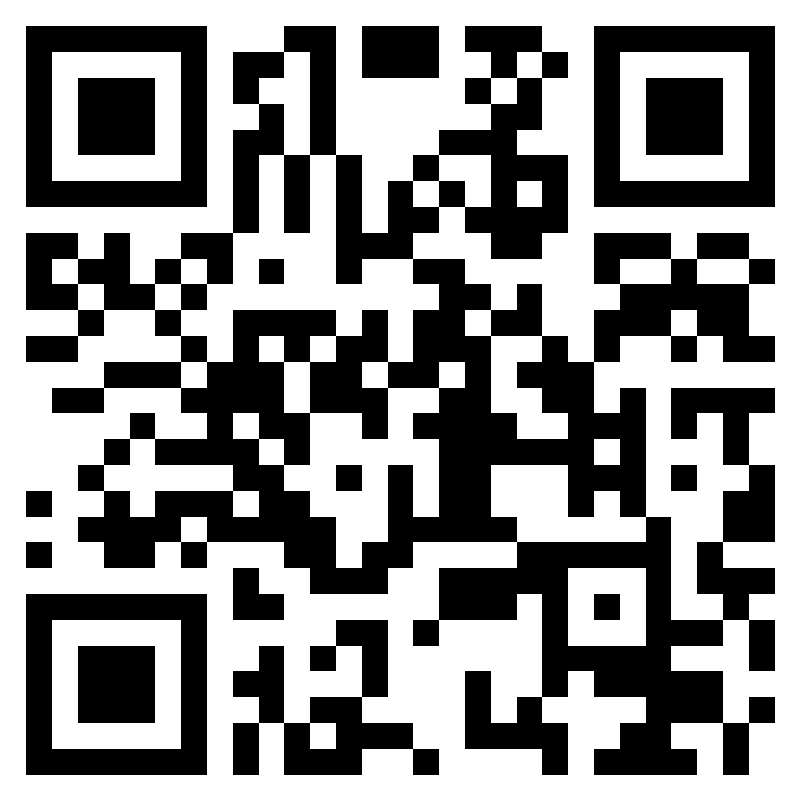

## Introduction to Git & GitHub — Final Exam

::: {.callout-note}
This exam is **only required if you want to obtain 0.25 ECTS credits** for
this course, **or if you'd simply like to test your own knowledge** from
today. If neither applies to you, you're welcome to skip it — attending
the course and completing the exercises is enough.
:::

A 20-question multiple-choice exam covering everything from today's course:
concepts & GitHub basics, local Git, branching & history, and GitHub
collaboration.

::: {.callout-important}
## Exam window

**Opens:** Wednesday, 8 July 2026, 17:00 (Europe/Zurich)
**Closes:** Wednesday, 15 July 2026, 23:59 (Europe/Zurich)

The exam link will only accept submissions during this window. You have
**one attempt**. Make sure you're ready before you start.
:::

---

## Before you start

- Have your name and email ready — these are required to identify your submission
- You do **not** need any reference material, but the [Git Cheat Sheet](git_cheatsheet.qmd) covers everything fairly
- There is no time limit once you open the form, but don't leave it open indefinitely — submit when done

---

## Take the exam

<a href="https://forms.office.com/e/Z8yAUvtWkA" target="_blank" class="btn btn-lg" style="background-color: #F05032; color: white; padding: 0.75em 2em; border-radius: 6px; text-decoration: none; font-weight: bold;">
Open the Exam (Microsoft Forms)
</a>

Or scan with your phone:

{width="220px"}

::: {.callout-note}
The exam opens in a new tab. If you arrive before 8 July 17:00 or after
15 July, Microsoft Forms will tell you the form is not currently accepting
responses — this is expected.
:::

---

## Course Feedback

Your feedback helps us improve this course for future participants. Please take 2 minutes to share your thoughts:

::: {.callout-important}
## Feedback window

**Opens:** Wednesday, 8 July 2026, 16:00 (Europe/Zurich)
**Closes:** Wednesday, 15 July 2026, 17:00 (Europe/Zurich)

The feedback form is optional and anonymous.
:::

<a href="https://forms.office.com/e/rEKqptMTMn" target="_blank" class="btn btn-lg" style="background-color: #4472C4; color: white; padding: 0.75em 2em; border-radius: 6px; text-decoration: none; font-weight: bold;">
Give Feedback (Microsoft Forms)
</a>

Or scan with your phone:

{width="220px"}

---

## After the exam

Results are reviewed by the instructor after the window closes on 15 July.
If you have questions about your result, contact
[deepak.tanwar@uzh.ch](mailto:deepak.tanwar@uzh.ch).
