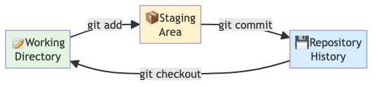

## Module 2: Let's build something

You know *why* Git matters. Now time to actually *use* it.

We'll build a realistic project — `experiment-tracker` — tracking one analysis from start to finish. Every Git concept you learn applies immediately.

---

## Getting started

First, check Git is installed and tell it who you are:

```bash
git --version

git config --global user.name "Your Name"
git config --global user.email "your.email@uzh.ch"
```

These are embedded in every commit you make.

---

## There are many git commands...

Before diving in, a reality check — Git is a big tool:

```
add       clone     commit    diff      fetch     init
log       merge     pull      push      remote    reset
branch    checkout  stash     status    tag       ...
```

. . .

**We will focus on about 12 of them today.**

The rest you can look up when you need them — `git help <command>`

---

## Common Git gotchas

Before you dive in, three things that surprise beginners:

. . .

::: {.callout-warning}

**Git tracks *files*, not folders**
- Empty folders don't show up in Git
- Workaround: put a `.gitkeep` file in empty folders you need

**Never delete the `.git` folder**
- It contains your entire history
- If you accidentally delete it, all commits are lost
- Backup important repos to GitHub as a safety net

**`.gitignore` doesn't un-track files**
- If a file was already committed, adding it to `.gitignore` won't remove it
- First remove it: `git rm --cached filename`
- Then add to `.gitignore`, then commit

:::

. . .

::: {.callout-tip}
When in doubt, `git status` and `git log` are your friends. They never lie.
:::

---

## What you'll practice today

Next, you'll build this workflow hands-on:

1. `git init` — create a repository
2. `git add` → `git commit` — save snapshots
3. `git diff` — inspect changes
4. `git log` — explore history

Ready? Let's go.

---

## A running example: tracking an experiment

Let's make those 12 commands concrete. Throughout today we will build one
realistic project — `experiment-tracker` —
the kind of folder you might keep next to a real experiment: sample metadata,
analysis notes, and a results summary. No programming language required.

```bash
cd ~/Downloads
mkdir experiment-tracker
cd experiment-tracker
git init
ls -a    # confirm the hidden .git folder was created
```

The `.git` folder is where Git stores everything. Never delete it.

---

## Tracking changes — the three stages

Every change you make moves through three places, in order:

**Working Directory** → (`git add`) → **Staging Area** → (`git commit`) → **Repository**

. . .

Why a staging area? Imagine you fixed a bug **and** started an unrelated
experiment in the same session. The staging area lets you commit the bug
fix alone, with its own clear message — without dragging in the half-finished
experiment.

---

## The staging area: explained

{width="95%" fig-align="center"}

**Three places where your code lives:**

1. **Working Directory** — your files, as you're editing them
2. **Staging Area** — you choose what goes into the next commit
3. **Repository** — your permanent history, safe and backed up

---

## How staging works

```
You edit file.txt
        ↓ (git add file.txt)
File is now STAGED (ready to commit)
        ↓ (git commit -m "message")
File is now in REPOSITORY (permanent history)
```

**Key insight:** Between editing and committing, you can choose exactly
what goes into each snapshot. This is the power of staging.

---

## The Git workflow: visual recap

Beginners ask: "How often should I commit?"

. . .

**One commit = one logical unit of work**

**Good commits:**
- "added sample metadata for 4 samples"
- "fixed normalization bug in analysis script"
- "documented methods section"
- "refactored QC function for clarity"

. . .

**Avoid:**
- "stuff I worked on today" (too vague)
- "fixed bug and added feature and updated docs" (too many things)

. . .

::: {.callout-tip}
**Rule of thumb:** If your commit message needs the word "and" in it, split it into two commits.
:::

---

## Your first file: sample metadata

Your repository exists but is empty. Let's put something in the working
directory — step 1 of the three stages:

```bash
nano samples.csv
```

```
sample_id,condition,replicate
S01,control,1
S02,control,2
S03,treated,1
S04,treated,2
```

`Ctrl+X → Y → Enter` to save and close.

---

## git status

The file exists, but Git hasn't been told to track it. Check what Git sees:

```bash
git status
```

```
On branch main

No commits yet

Untracked files:
  (use "git add <file>..." to include in what will be committed)
        samples.csv
```

Git sees the file but is not tracking it yet.

---

## git add → git commit

::: {.panel-tabset}

### Terminal

```bash
# Stage the file
git add samples.csv

git status   # now it shows "Changes to be committed"

# Commit
git commit -m "added sample metadata for 4 samples"

git status   # now: "nothing to commit, working tree clean"
```

::: {.callout-tip}
The CLI does the same thing underneath. Use the terminal when you're comfortable, or any tool that feels natural.
:::

:::

---

## git log

```bash
git log
```

```
commit ac3eveta1234...
Author: Deepak Tanwar <deepak@uzh.ch>
Date:   Mon Jun 23 09:45:00 2025

    added sample metadata for 4 samples
```

```bash
git log --oneline   # compact view
```

---

## Writing good commit messages

Your commit message is a **note to future-you** (or a labmate) explaining *why* you made this change.

**Good format:**

```
imperative verb: what changed

Optional longer explanation here if needed.
Can reference an issue: "closes #42"
```

**Examples:**
- `add qc step to analysis pipeline`
- `fix alignment scoring bug in normalization`
- `update readme with installation instructions`

---

## Commit message anti-patterns

Avoid vague or multi-purpose messages:

**❌ Bad examples:**
- `"fixed stuff"`
- `"work in progress"`
- `"as requested"`
- `"I changed the code again"`

---

## Pro tip: Reference issues in commits

Link commits to GitHub issues automatically:

```bash
git commit -m "fix duplicate sample handling, closes #7"
```

This automatically closes issue #7 when you merge to main.

---

## The staging area recap

{width="90%" fig-align="center"}

The staging area is your **safety net**: you can see exactly what will go into your next commit before it's permanent.

---

## HEAD

HEAD = pointer to the **latest commit** on your current branch.

{width="70%" fig-align="center"}

When you make a new commit, HEAD moves forward automatically.

::: {.callout-tip}
Think of HEAD as a sticky note that says "you are here" — it always points
to the tip of whichever branch you're currently on.
:::

---

## git diff

Diffing shows **what changed** between two states:

{width="60%" fig-align="center"}

::: {.panel-tabset}

### Terminal

```bash
# Working directory vs staging area (unstaged changes)
git diff

# Staging area vs last commit (what will be in next commit)
git diff --staged

# Working directory vs last commit (everything changed)
git diff HEAD

# Two specific commits
git diff <hash1> <hash2>
```

Terminal diffs use `+`/`-` prefixes per line — green `+` for added, red `-`
for removed.

:::

---

## Exercise 3 — Local Git Workflow

You just learned the gotchas, the one-unit rule, and commit message best practices.

See [Exercise 3](../exercises/exercise_3_local_git.qmd) for the full walkthrough.

**Part 1: Setup & tracking**

1. `mkdir experiment-tracker && cd experiment-tracker && git init`
2. Create `samples.csv` with sample metadata, `git add`, `git commit`
3. Create `analysis_log.md`, document steps with clear commit messages

---

## Exercise 3 continued

**Part 2: Inspecting history**

4. `git log --oneline` — see all your commits
5. `git diff` before staging; `git diff --staged` after staging
6. Compare commits: `git diff HASH1 HASH2`

**Key practice:** Write commit messages using the "one-unit rule" and imperative format.

---

## Ready for Module 3?

You've mastered the local workflow: init → commit → log → diff.

Your repository is on your machine only. Next: create branches to try new ideas safely, merge results back, and handle conflicts.

**You now have the power to experiment without fear.** 🌳
